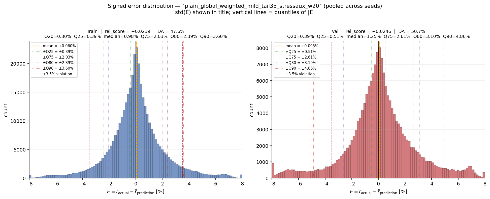
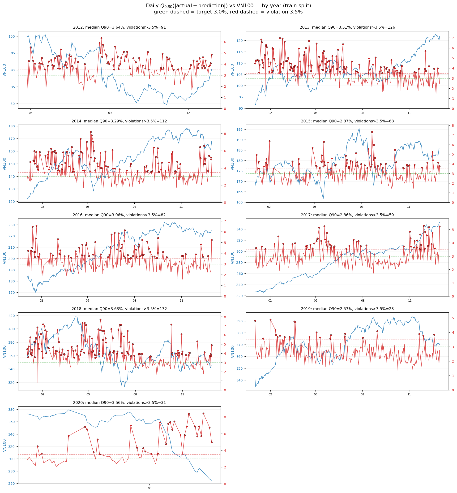

# Báo Cáo Chẩn Đoán Lỗi Mô Hình LSTM Dự Báo Next-Day Return — VN

**Ngày**: 2026-05-21  
**Phạm vi**: VN train (≤ 2020-03-31) và validation (2020-04-01 → 2022-11-15). Holdout/test chưa sử dụng.  
**Universe**: VN100, 93 mã, 1,959 trading days (train), 659 trading days (validation).  
**Mô hình**: LSTM tail-aware `stressaux_w20` (plain LSTM [64,32] + stress auxiliary head).  
**Features**: 26 features kỹ thuật + market context (xem §4 chi tiết).  
**Fine-tune scope**: kiến trúc, loss, auxiliary head, preprocessing — chỉ trên train/validation VN. Holdout/test chưa mở.

---

## 1. Kết Quả Hiện Tại

### 1.1. Metrics tổng hợp (3 seeds: 43, 52, 71)

| Metric | Train | Validation |
| --- | ---: | ---: |
| rel\_score (mean ± std) | +0.0237 ± 0.0018 | **+0.0248 ± 0.0072** |
| Median &#124;E&#124; | 0.98% | 1.25% |
| Q90(&#124;E&#124;) | 3.60% | 4.86% ± 0.05% |
| Daily Q90 max | 8.89% | 9.44% ± 0.17% |
| Directional accuracy | 47.6% | 50.70% ± 0.34% |
| Spike days ≥ 8% | 2.0 | 7.7 ± 4.5 |
| Pred/Actual Q90 ratio | 0.171 | 0.166 ± 0.004 |

Ghi chú:
- **26 features** đầu vào (technical + market context), window = 15 ngày.
- **93 mã** VN (universe VN100 mở rộng).
- Fine-tune trên **train split** (2012-05 → 2020-03), evaluate trên **validation** (2020-04 → 2022-11).
- Holdout/test (2022-11 → nay) **chưa được sử dụng** trong bất kỳ tuning nào.

### 1.2. Histogram phân phối sai số (signed)



Cách đọc:
- Trục x: E = actual − prediction (%), dạng âm dương.
- Vạch cam đứt nét: mean error.
- Vạch xanh chấm: ±Q25(|E|).
- Vạch tím chấm: ±Q75(|E|).
- Vạch nâu chấm: ±Q80(|E|).
- Vạch đỏ chấm: ±Q90(|E|).
- Vạch đỏ sẫm đứt nét: ±3.5% (violation line).

Quan sát:
- Phân phối near-symmetric quanh 0 → mô hình không bias hướng.
- Tail dày cả 2 phía, kéo dài tới ±8–9% → spike days.
- Validation rộng hơn train → cross-sectional dispersion tăng trong val period.


---

## 2. Time-Series Q90(|E|) Theo Năm

### 2.1. Công thức

Với mỗi ngày giao dịch d, tính Q90 cross-sectional của absolute error:

$$
\text{ts-error}(d) = Q_{0.90}\big(\{|r_{i,d+1} - \hat{r}_{i,d+1}| : i \in \mathcal{U}_d\}\big)
$$

Mục tiêu: đường đỏ nằm dưới vạch 3.0% (target). Vi phạm: vượt 3.5%.

### 2.2. Multi-panel grid (9 năm, train split)



Cách đọc:
- **Đường xanh** (trục trái): VN100 index proxy.
- **Đường đỏ** (trục phải): Q90(|E|) daily (%).
- **Vạch xanh đứt nét**: target 3.0%.
- **Vạch đỏ đứt nét**: violation 3.5%.
- **Chấm đỏ**: ngày vi phạm > 3.5%.

### 2.3. Tổng hợp theo năm

| Năm | median Q90 | P90 | max | days > 3.5% | share violation | VN100 Δ |
| ---: | ---: | ---: | ---: | ---: | ---: | ---: |
| 2012 | 3.64% | 4.74% | 6.36% | 91 | 59.1% | -9.9% |
| 2013 | 3.51% | 5.07% | 6.98% | 126 | 50.4% | +32.6% |
| 2014 | 3.29% | 5.82% | 8.20% | 112 | 45.3% | +37.4% |
| 2015 | 2.87% | 4.20% | 7.32% | 68 | 27.4% | +11.0% |
| 2016 | 3.06% | 4.47% | 6.55% | 82 | 32.7% | +21.7% |
| 2017 | 2.86% | 3.95% | 5.28% | 59 | 23.6% | +55.9% |
| 2018 | 3.63% | 5.85% | 7.68% | 132 | 52.8% | -3.3% |
| 2019 | **2.53%** | 3.44% | 4.88% | 23 | **9.2%** | +8.5% |
| 2020 | 3.56% | 7.02% | 8.41% | 31 | 52.5% | -28.9% |

Năm tốt nhất: **2019** (9.2% violation, median 2.53%). Năm tệ nhất: **2012, 2018, 2020** (>50%).

### 2.4. Plot từng năm (zoomed)

| Năm | Link |
| ---: | --- |
| 2017 | [q90\_error\_2017\_threshold.png](./plots/teacher_style_threshold_replot_20260521/by_year/q90_error_2017_threshold.png) |
| 2018 | [q90\_error\_2018\_threshold.png](./plots/teacher_style_threshold_replot_20260521/by_year/q90_error_2018_threshold.png) |
| 2019 | [q90\_error\_2019\_threshold.png](./plots/teacher_style_threshold_replot_20260521/by_year/q90_error_2019_threshold.png) |
| 2020 | [q90\_error\_2020\_threshold.png](./plots/teacher_style_threshold_replot_20260521/by_year/q90_error_2020_threshold.png) |

(Các năm khác: [by\_year/](./plots/teacher_style_threshold_replot_20260521/by_year/))


---

## 3. Chẩn Đoán: Tại Sao Có Spikes > 3.5%

### 3.1. Pattern toán học chung

Qua 8 đoạn vi phạm lớn nhất, pattern nhất quán:

$$
\frac{Q_{0.90}(|\hat{r}|)}{Q_{0.90}(|r|)} \in [0.13,\ 0.40]
$$

Nghĩa là mô hình luôn under-amplify 5–7 lần ở tail.

| Segment | Q90 actual | Q90 prediction | Ratio | Sign mismatch |
| --- | ---: | ---: | ---: | ---: |
| 2018-05 → 06 (18 ngày) | 4.29% | 1.03% | 0.253 | 41.2% |
| 2018-01 → 02 (15 ngày) | 5.63% | 0.96% | 0.168 | 44.8% |
| 2013-05 (15 ngày) | 4.20% | 0.68% | 0.173 | 55.8% |
| 2014-04 → 05 (11 ngày) | 6.33% | 1.97% | 0.317 | 47.3% |
| 2020-03 COVID (10 ngày) | 6.73% | 2.36% | 0.387 | 45.6% |

Đặc trưng:
1. Actual cross-sectional dispersion phình to (Q90 actual ↑ 4–7% vs baseline ~2–3%).
2. Prediction magnitude hầu như không đổi (~0.5–2%).
3. Mô hình **under-react 5–7×** ở tail.
4. Sign mismatch ≈ 45–55%: gần random direction trong tail days.

### 3.2. Top error stocks

| Code | Sector | Appearances | Pattern |
| --- | --- | ---: | --- |
| VND | Dịch vụ tài chính | 4 | high beta |
| PVD, GAS | Dầu khí | 3+3 | commodity-driven |
| HSG, NKG | Tài nguyên Cơ bản | 3+3 | metal cycle |
| VIC, DXG, DIG, KBC | Bất động sản | 5+ | sector dominant |
| BID, CTG, STB | Ngân hàng | 3-4 | systemic risk |

→ Chi tiết per-segment: [violation\_diagnostics.md](./plots/teacher_style_threshold_replot_20260521/violation_diagnostics.md)

### 3.3. Giả thuyết

| # | Hypothesis | Evidence |
| --- | --- | --- |
| H1 | **Volatility forecasting missing** | Pred/actual ratio 0.13–0.40 ổn định qua mọi segment. Model không "biết" hôm nay là tail day. |
| H2 | **Regime-conditioned signal** | 2019 (low-vol) violation 9.2%; 2018, 2020 (volatile) > 50%. |
| H3 | **Sector rotation not captured** | BĐS, oil, banking dominant. Stock features chủ yếu technical. |
| H4 | **Cross-sectional features missing** | Sign mismatch ~50% ở tail. Direction signal yếu khi market move lớn. |
| H5 | **Era bias** | 2012-2014 violation cao hơn 2019. |
| H6 | **Out-of-distribution events** | 2020 COVID unprecedented in train. |


---

## 4. Mô Hình — Công Thức Đang Sử Dụng

### 4.1. Features (26 features)

| # | Feature | Loại |
| ---: | --- | --- |
| 1 | volume\_ratio\_20 | stock technical |
| 2 | intraday\_return | stock technical |
| 3 | gap\_open | stock technical |
| 4 | close\_position | stock technical |
| 5 | upper\_shadow | stock technical |
| 6 | lower\_shadow | stock technical |
| 7 | momentum\_5 | stock technical |
| 8 | momentum\_20 | stock technical |
| 9 | volatility\_20 | stock technical |
| 10 | ma\_200\_gap | stock technical |
| 11 | rolling\_max\_20\_gap | stock technical |
| 12 | bb\_width | stock technical |
| 13 | vwap\_gap | stock technical |
| 14 | obv\_change | stock technical |
| 15 | macd\_hist | stock technical |
| 16 | effort\_result\_ratio | stock technical (Wyckoff) |
| 17 | buying\_pressure | stock technical (Wyckoff) |
| 18 | selling\_pressure | stock technical (Wyckoff) |
| 19 | wyckoff\_phase\_60d | stock technical (Wyckoff) |
| 20 | rsi\_14 | stock technical |
| 21 | a\_d\_ratio | market context |
| 22 | market\_leader\_return | market context |
| 23 | vnindex\_return | market context |
| 24 | day\_of\_week | calendar |
| 25 | sector\_momentum\_rank | sector context |
| 26 | is\_top\_2\_sector | sector context |

### 4.1b. Công thức feature engineering nền tảng

Các feature hiện tại chủ yếu dựa trên bốn nhóm công thức: return tỷ lệ, rolling statistics, candle/price-shape, và market/sector context.

Stock technical:

$$
\text{intraday-return}_{i,t} = \frac{close_{i,t}}{open_{i,t}} - 1
$$

$$
\text{gap-open}_{i,t} = \frac{open_{i,t}}{close_{i,t-1}} - 1
$$

$$
\text{close-position}_{i,t} =
\frac{close_{i,t} - low_{i,t}}{high_{i,t} - low_{i,t} + \varepsilon}
$$

$$
\text{upper-shadow}_{i,t} =
\frac{high_{i,t} - \max(open_{i,t}, close_{i,t})}{close_{i,t} + \varepsilon}
$$

$$
\text{lower-shadow}_{i,t} =
\frac{\min(open_{i,t}, close_{i,t}) - low_{i,t}}{close_{i,t} + \varepsilon}
$$

Momentum, volatility, trend:

$$
\text{momentum-}n_{i,t} = \frac{adjust_{i,t}}{adjust_{i,t-n}} - 1,\quad n \in \{5, 20\}
$$

$$
\text{volatility-20}_{i,t} = Std(r_{i,t-19:t})
$$

$$
\text{ma-200-gap}_{i,t} = \frac{adjust_{i,t}}{MA_{200}(adjust_i)_t} - 1
$$

$$
\text{rolling-max-20-gap}_{i,t} =
\frac{adjust_{i,t}}{\max(adjust_{i,t-19:t})} - 1
$$

Liquidity / band / oscillator:

$$
\text{volume-ratio-20}_{i,t} =
\frac{volume_{i,t}}{MA_{20}(volume_i)_t + \varepsilon}
$$

$$
\text{bb-width}_{i,t} =
\frac{BB^{upper}_{20,i,t} - BB^{lower}_{20,i,t}}{BB^{mid}_{20,i,t} + \varepsilon}
$$

$$
\text{vwap-gap}_{i,t} =
\frac{close_{i,t}}{value\_match_{i,t}/(volume\_match_{i,t}+\varepsilon)} - 1
$$

$$
MACD_{i,t} = EMA_{12}(adjust_i)_t - EMA_{26}(adjust_i)_t
$$

$$
\text{macd-hist}_{i,t} = MACD_{i,t} - EMA_9(MACD_i)_t
$$

$$
RSI_{14,i,t} = 100 - \frac{100}{1 + AvgGain_{14,i,t}/(AvgLoss_{14,i,t}+\varepsilon)}
$$

Wyckoff/pressure:

$$
volume^{norm}_{i,t} = \frac{volume_{i,t}}{\max(volume_{i,t-19:t}) + \varepsilon}
$$

$$
\text{buying-pressure}_{i,t} =
\frac{close_{i,t} - low_{i,t}}{high_{i,t} - low_{i,t} + \varepsilon}
\cdot volume^{norm}_{i,t}
$$

$$
\text{selling-pressure}_{i,t} =
\frac{high_{i,t} - close_{i,t}}{high_{i,t} - low_{i,t} + \varepsilon}
\cdot volume^{norm}_{i,t}
$$

$$
\text{wyckoff-phase-60d}_{i,t} =
\frac{close_{i,t} - \min(low_{i,t-59:t})}
{\max(high_{i,t-59:t}) - \min(low_{i,t-59:t}) + \varepsilon}
$$

Market/sector context:

$$
\text{a-d-ratio}_t =
\frac{\left|\{i: r_{i,t} > 0\}\right|}
{\left|\{i: r_{i,t} < 0\}\right| + 1}
$$

$$
\text{liquidity-score}_{j,t} = MA_{60}(traded\_value_{j,t-1})
$$

$$
LeaderSet_t = TopK_j(\text{liquidity-score}_{j,t})
$$

$$
w_{j,t} =
\frac{\text{liquidity-score}_{j,t}}
{\sum_{\ell \in LeaderSet_t}\text{liquidity-score}_{\ell,t}}
$$

$$
\text{market-leader-return}_t =
\sum_{j \in LeaderSet_t}w_{j,t}r_{j,t}
$$

$$
\text{sector-return}_{s,t}^{(-i)} =
mean_{j \ne i,\ sector(j)=s}(r_{j,t})
$$

$$
\text{sector-momentum-rank}_{i,t} =
rank_s(mean_{j:sector(j)=s}(\text{momentum-20}_{j,t-1}))
$$

$$
\text{is-top-2-sector}_{i,t} =
\mathbb{1}[\text{sector-momentum-rank}_{i,t} \le 2]
$$

### 4.2. Input normalization

Train-only z-score per feature:

$$
\tilde{x}_{i,t,k} = \frac{x_{i,t,k} - \mu_k^{\text{Train}}}{\sigma_k^{\text{Train}} + \varepsilon}
$$

### 4.3. Target normalization (per-stock volatility)

$$
s_{i,t} = \max(|\text{volatility-20}_{i,t}|,\ \text{floor})
$$

$$
y^{\text{local}} = \frac{r_{i,t+1}}{s_{i,t}}, \quad y^{\text{model}} = \frac{y^{\text{local}} - \mu_y}{\sigma_y}
$$

Inverse khi predict:

$$
\hat{r}_{i,t+1} = (\hat{y}^{\text{model}} \cdot \sigma_y + \mu_y) \cdot s_{i,t}
$$

### 4.4. LSTM backbone

$$
h_{i,t} = \text{LSTM}_{[64, 32]}(\tilde{X}_{i,t}), \quad \hat{y}_{i,t+1} = W_r \cdot h_{i,t} + b_r
$$

Nếu thầy hỏi LSTM cụ thể dựa trên công thức nào, có thể nêu cell LSTM chuẩn:

$$
i_\tau = \sigma(W_i x_\tau + U_i h_{\tau-1} + b_i)
$$

$$
f_\tau = \sigma(W_f x_\tau + U_f h_{\tau-1} + b_f)
$$

$$
o_\tau = \sigma(W_o x_\tau + U_o h_{\tau-1} + b_o)
$$

$$
\tilde{c}_\tau = \tanh(W_c x_\tau + U_c h_{\tau-1} + b_c)
$$

$$
c_\tau = f_\tau \odot c_{\tau-1} + i_\tau \odot \tilde{c}_\tau
$$

$$
h_\tau = o_\tau \odot \tanh(c_\tau)
$$

Trong đó `i`, `f`, `o` lần lượt là input gate, forget gate, output gate; `c` là cell memory. Mô hình đang dùng hai tầng LSTM với hidden units `[64, 32]`, tức output của tầng đầu là input cho tầng sau.

Input shape: 15 × 26. Hyperparameters: dropout 0.05, lr 5×10⁻⁴, Adam clipnorm 1.0, batch 64, epochs 18, patience 5.

### 4.5. Stress auxiliary head

$$
\hat{p}^{\text{stress}} = \sigma(W_a \cdot h_{i,t} + b_a)
$$

$$
z^{\text{stress}}_t = \mathbb{1}[\text{market-negative-ratio}_t \ge Q_{0.75}^{\text{Train}}]
$$

$$
\mathcal{L} = \mathcal{L}_{\text{return}} + 0.20 \cdot \mathcal{L}_{\text{BCE}}(z^{\text{stress}},\ \hat{p}^{\text{stress}})
$$

Auxiliary head chỉ làm regularizer; output chính vẫn là return prediction.

### 4.6. Robust loss (rel\_score)

$$
\mathcal{L}_{\text{robust}}(z) = Q_{0.5}(|z|) + 0.5 \cdot Q_{0.9}(|z|)
$$

$$
\text{rel-score} = 1 - \frac{\mathcal{L}_{\text{robust}}(E)}{\mathcal{L}_{\text{robust}}(r)}
$$

### 4.7. Error-control / selective forecasting layer

Phần này là lớp phía sau LSTM, dùng để giảm các ngày/mã có xác suất lỗi lớn:

$$
u_{i,t} = \Phi(X_{i,t},\ \hat{r}_{i,t+1},\ market\_state_t)
$$

$$
\hat{p}^{err}_{i,t} =
P(|E_{i,t+1}| > \tau_e \mid u_{i,t})
$$

Với logistic risk model:

$$
\hat{p}^{err}_{i,t} =
\sigma(\beta^\top u_{i,t} + b)
$$

Với HGB risk model, hàm `g` là ensemble cây boosting:

$$
\hat{p}^{err}_{i,t} = g_{\text{HGB}}(u_{i,t})
$$

Quy tắc accept:

$$
accept_{i,t} = \mathbb{1}[\hat{p}^{err}_{i,t} \le c]
$$

Trong đó `c` được chọn trên train/calibration để đạt mục tiêu coverage hoặc mục tiêu daily `q90(|E|)`. Đây là lý do có thể nói mô hình hiện tại gồm hai tầng:

```text
LSTM return forecast -> error-control/confidence layer
```

### 4.8. Fine-tune scope

| Đã tune trên train/val | Chưa dùng |
| --- | --- |
| Kiến trúc LSTM (units, layers) | Holdout/test split |
| Loss function (rel\_score variants) | Dữ liệu JP/KR/US |
| Auxiliary head (stress, tail) | Out-of-sample evaluation |
| Preprocessing (target scale, feature z-score) | |
| Window size (15 vs 10 vs 20) | |
| Seeds (43, 52, 71) | |


---

## 5. Mô Hình — Các Module Chưa Có (Đề Xuất)

Các module dưới đây là phần **chưa có trong model đang promote**. Chúng được nêu như hướng phát triển tiếp để trả lời vấn đề spike/tail, không nên trình bày như kết quả đã chốt.

### 5.1. Volatility forecasting head + heteroscedastic NLL — HIGH

$$
\hat{\sigma}_{i,t+1}^2 = \text{softplus}(W_v \cdot h_{i,t} + b_v)
$$

$$
\mathcal{L}_{\text{NLL}} = \frac{1}{N}\sum_{i,t}\Big[\frac{(r_{i,t+1} - \hat{r}_{i,t+1})^2}{2\hat{\sigma}_{i,t+1}^2} + \frac{1}{2}\log\hat{\sigma}_{i,t+1}^2\Big]
$$

Lợi ích: model học thêm độ bất định của dự báo. Khi market state có rủi ro cao, mô hình không chỉ trả về point forecast mà còn trả về uncertainty để biết forecast kém tin cậy hơn.

### 5.2. Supervised context-useful gate — HIGH

$$
g_\theta(\text{context}_{i,t}) \in [0, 1]
$$

$$
\text{label} = \mathbb{1}[|E^{\text{stock-only}}_{i,t}| - |E^{\text{context}}_{i,t}| > \delta]
$$

$$
\hat{r}_{i,t+1} = \hat{r}^{\text{stock}} + g_\theta \cdot (\hat{r}^{\text{context}} - \hat{r}^{\text{stock}})
$$

### 5.3. Conformal prediction interval — HIGH

$$
S_i = |y_i - \hat{y}_i|, \quad i \in \mathcal{T}_{\text{cal}}
$$

$$
\hat{C}_\alpha(x_t) = [\hat{y}_t - \hat{q}_\alpha,\ \hat{y}_t + \hat{q}_\alpha], \quad P(y_t \in \hat{C}_\alpha) \ge 1 - \alpha
$$

### 5.4. Distributional / quantile regression — MEDIUM

$$
\hat{q}_\tau = W_\tau \cdot h_{i,t} + b_\tau, \quad \tau \in \{0.1, 0.25, 0.5, 0.75, 0.9\}
$$

### 5.5. Cross-sectional rank loss — LOW

$$
\mathcal{L}_{\text{rank}} = \frac{1}{|\mathcal{P}_t|}\sum_{(i,j) \in \mathcal{P}_t} \text{softplus}\big(-(\hat{r}_i - \hat{r}_j)\cdot\text{sign}(r_i - r_j)\big)
$$

---

## 6. Pipeline Cải Thiện

| Priority | Hypothesis | Implementation | Decision rule |
| ---: | --- | --- | --- |
| 1 | H1 (vol forecasting) | σ head + NLL loss | Giảm violation rate ≥ 10% AND giữ rel\_score |
| 2 | H2 (regime gate) | Supervised gate | Giảm spike days ≥ 50% |
| 3 | H4 (rank features) | momentum\_20\_cs\_rank | Improve DA ≥ 2% |
| 4 | H6 (conformal) | Split-conformal | Coverage guarantee |
| 5 | H3 (sector flow) | sector\_net\_buy\_ratio | Giảm BĐS/oil error |
| 6 | H5 (era bias) | Time-decay weighting | Giảm 2012-2014 violation |

---

## 7. Tham Chiếu

| Artifact | Link |
| --- | --- |
| Histogram phân phối lỗi | [error\_histogram\_pooled.png](./plots/relscore_histograms_20260521/error_histogram_pooled.png) |
| Timeseries Q90 grid | [q90\_error\_by\_year\_threshold.png](./plots/teacher_style_threshold_replot_20260521/q90_error_by_year_threshold.png) |
| Per-year plots | [by\_year/](./plots/teacher_style_threshold_replot_20260521/by_year/) |
| Violation segments | [violation\_segments.csv](./plots/teacher_style_threshold_replot_20260521/violation_segments.csv) |
| Per-segment diagnostics | [violation\_diagnostics.md](./plots/teacher_style_threshold_replot_20260521/violation_diagnostics.md) |
| Per-seed metrics | [per\_seed\_metrics.csv](./plots/relscore_histograms_20260521/per_seed_metrics.csv) |
| Yearly summary | [per\_year\_summary.csv](./plots/teacher_style_threshold_replot_20260521/per_year_summary.csv) |
| Mathematical report (policy) | [mathematical\_report.md](./mathematical_report.md) |
| Improvement progress log | [improvement\_progress\_log\_20260519.md](../../docs/improvement_progress_log_20260519.md) |
